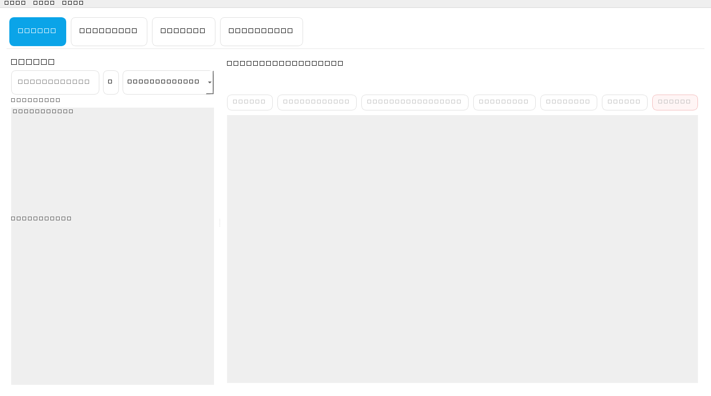
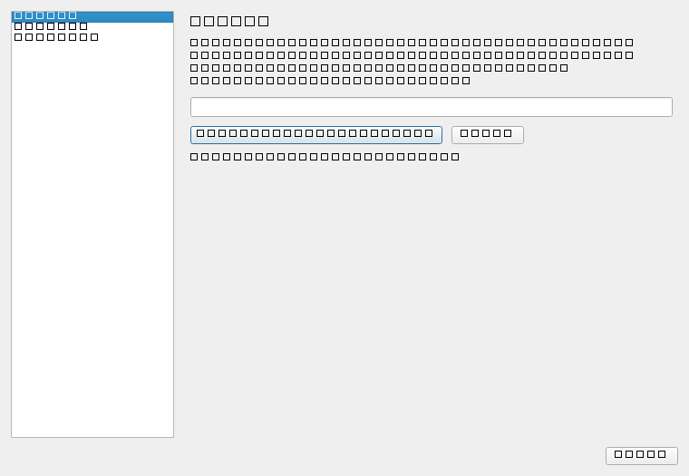

# BioTagPhoto

BioTagPhoto is a local Windows desktop application for organizing people in photos. It helps you detect faces, review unknown matches, assign people, and write selected names back into image metadata without uploading your photo library to a cloud service.

Version: `2026.02.01BETA`

## Why BioTagPhoto

- local-first photo review for face-based organization
- manual review workflow instead of silent background tagging
- person assignments, prototype embeddings, and similarity suggestions
- XMP tagging for selected person names
- backup and restore for the local database
- Windows release pipeline with PyInstaller and Inno Setup

## Highlights

- `Unknown` review page for newly detected faces
- `People` page for grouped faces and person-level actions
- metadata viewer for EXIF, IPTC, and XMP where available
- optional face-analysis model integration via InsightFace
- no bundled face model weights in this repository or installer

## Screenshots

### Main Window



### Settings Dialog



## Quick Start

### Option 1: Run from source

```powershell
python -m venv .venv
.\.venv\Scripts\Activate.ps1
python -m pip install --upgrade pip
pip install -r requirements.txt
python main.py
```

### Option 2: Use a release build

Build the Windows app bundle:

```powershell
.\tools\build_release.ps1 -SkipInstaller
```

Build bundle and installer:

```powershell
.\tools\build_release.ps1
```

Outputs:

```text
dist\BioTagPhoto\BioTagPhoto.exe
release\BioTagPhoto_Setup_2026.02.01BETA.exe
```

## Typical Workflow

1. Start BioTagPhoto.
2. Configure the InsightFace model folder when prompted, or later via `Settings > Models`.
3. Add one or more source folders in `Settings > Sources`.
4. Open `Unknown` and run `Analyze Images`.
5. Review unknown faces and assign them to an existing or new person.
6. Open `People` to inspect grouped faces, remove wrong assignments, and view metadata.
7. Optionally write a selected person's name into XMP with `Tag Photo`.
8. Export a backup before major data changes.

## Requirements

- Windows recommended
- Python 3.10 or 3.11 recommended for best third-party wheel support
- local virtual environment for source-based development
- separate installation of the InsightFace `buffalo_l` model pack if you want face analysis

## Model Setup

BioTagPhoto does not ship the `buffalo_l` model pack.

You must download and install it separately, then configure the model folder in the application. On first start, BioTagPhoto prompts for the folder if it is not configured yet.

Expected structure:

```text
<models-root>\buffalo_l\...
```

Typical location used by InsightFace:

```text
%USERPROFILE%\.insightface\models
```

## Development Setup

Install runtime and development tooling:

```powershell
pip install -r requirements-dev.txt
```

Useful checks:

```powershell
python -m compileall -q .
python -m py_compile main.py db.py ui\main_window.py
python tools\sanity_check.py
```

## Repository Layout

```text
ui/                Qt UI pages, dialogs, workers, and jobs
packaging/         PyInstaller and Inno Setup configuration
tools/             helper scripts and sanity checks
docs/screenshots/  README screenshots
main.py            application entry point
db.py              SQLite schema and data access
embeddings.py      embedding rebuild helpers
```

## Legal and Licensing

BioTagPhoto source code is released under the `MIT` license.

Before distribution or commercial use, read:

- `LICENSE`
- `NOTICE`
- `THIRD_PARTY_NOTICES.md`
- `PRIVACY.md`
- `LEGAL.md`

Important:
Third-party libraries and model files are subject to their own license terms. The BioTagPhoto source code license does not automatically apply to external models.

## Contributing

See `CONTRIBUTING.md`.

## Contact

Thomas Steier  
BioTagPhoto@steier-familie.de
